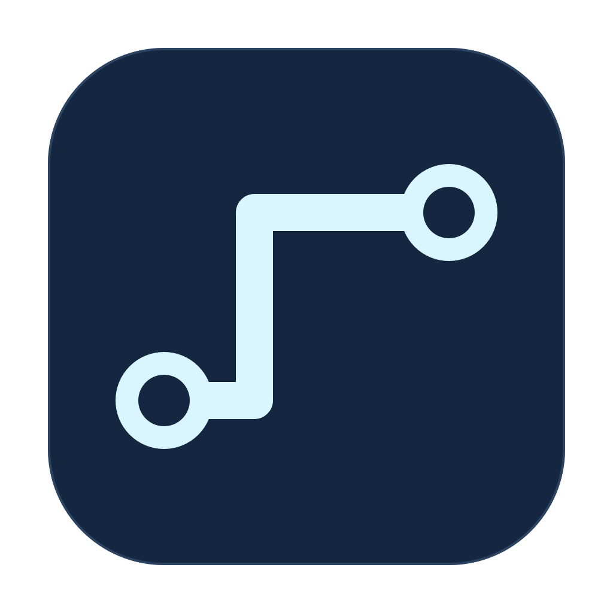

# PipeDesk

A native macOS menu bar app for Dumbpipe connections and existing Secure Shell (SSH) tunnels.

PipeDesk connects two devices without a fixed remote address. It manages the Dumbpipe process, local ports, retries, and sleep recovery.
It also keeps the original SSH tunnel workflow through an explicit configuration import.



## Requirements

- macOS 13 or later.
- Xcode Command Line Tools to build the app.
- [Dumbpipe](https://github.com/n0-computer/dumbpipe) for Connect and Share.
- An authenticated remote service, such as OpenSSH, for shell access.

The client uses AppKit and macOS process inspection. It does not run on Linux or Windows.
A remote machine can use any operating system supported by its Dumbpipe binary and chosen service.
The build targets the current Mac architecture.

## Build and install

1. Build the app:

   ```sh
   ./build.sh
   ```

2. Install the app:

   ```sh
   mkdir -p ~/Applications
   ditto .build/PipeDesk.app ~/Applications/PipeDesk.app
   open ~/Applications/PipeDesk.app
   ```

The build uses local ad hoc signing. It does not create a notarized distribution.
Build output stays under `.build`. Set `PIPEDESK_APP_PATH` to choose another output path.

## Connect two devices

1. Install Dumbpipe on both devices:

   ```sh
   brew install dumbpipe
   ```

   With Rust installed, `cargo install dumbpipe` also works.

2. On the service machine, open PipeDesk and choose **Share**.
3. Enter a name and the service port. For an SSH server, use port 22.
4. Save the share. Start it from its menu, then choose **Copy Ticket**.
5. On the other Mac, choose **Connect** and paste the ticket.
6. Choose a free local port, such as 2222. Save the connection and start it.
7. Use the local address to reach the service:

   ```sh
   ssh -p 2222 YOUR_REMOTE_USER@127.0.0.1
   ```

Check the remote host fingerprint before you accept it.
Use a distinct local port for each remote SSH host to avoid host key conflicts.

**Ticket holders can reach the shared service.** Share an authenticated service when you need access control.
Dumbpipe provides transport encryption. It does not replace the service's authentication.

Connect binds only to `127.0.0.1`. Share forwards only to `127.0.0.1` on its own machine.
The app never opens a local forward on every network interface.

## Remote setup

Open **Add Pipe or Set Up Remote**, then choose **Remote Setup**.
The app provides copyable steps for macOS and Linux, including a persistent private identity.
This path needs initial access to the remote machine.
It does not install or restart a remote startup service.

For a remote Mac, PipeDesk can manage the Share process directly.
Enable Remote Login in System Settings before sharing port 22.

For a remote Linux machine, keep the listener alive in your session or configure a systemd service.
The remote setup instructions retain the same identity when you restart the listener.
PipeDesk copies a stable identity ticket for its Share profiles. Remote command output can include addresses that change after restart.
For a stable remote ticket, run `dumbpipe generate-ticket` with the same `IROH_SECRET`.

## Status and controls

| Status | Meaning |
|---|---|
| Stopped | PipeDesk does not want this process running. |
| Starting | The process has not reached local readiness. |
| Listening | This connection owns its local listening port. |
| Sharing | The listener has produced a ticket. |
| Error text | The process failed or reported an error. |

Listening does not prove that the remote service responds. Open the service to check the full path.
The menu bar symbol has a gap when pipes are inactive or only partly ready.
The symbol joins when all configured pipes are ready.

Start and stop each profile from its submenu. Copy tickets and local addresses from the same submenu.
New Dumbpipe profiles remain stopped until you start them.
Choose **Start at Launch** in a profile's submenu to start that pipe whenever the app opens.
Reloading profiles stops every pipe, then starts the ones set to start at launch.
Automatic reconnection retries failed processes with a delay from five seconds to one minute.
Sleep stops active processes. Wake restarts the profiles that were active before sleep.
**Open at Login** starts the app. Pair it with **Start at Launch** to restore a pipe after a restart.
A tunnel from `ssh.json` waits for the pipes to listen before its first attempt, for up to 30 seconds.

## PipeDesk configuration

PipeDesk reads tunnel profiles from `~/.config/pipedesk/ssh.json`.
Choose **Import SSH Configuration** to copy an existing configuration file into that location.
Import retains the original file and starts the configured tunnels.
Import starts the configured tunnels. Imported `restartAgent` labels restart during import and application startup.
PipeDesk uses existing SSH aliases, port forwards, and authentication.
Use **Edit SSH Configuration** to add or change aliases after import.

The SSH configuration format is:

```json
{
  "tunnels": [
    {
      "name": "Example server",
      "tunnelAlias": "example-forward",
      "shellAlias": "example-shell",
      "probePort": 8080,
      "links": [{"label": "Web service", "url": "http://127.0.0.1:8080"}],
      "controlPath": "~/.ssh/example-control.sock"
    }
  ]
}
```

Define these aliases in `~/.ssh/config`. PipeDesk runs the forward alias with `ssh -N`.
New installations have no personal aliases, ports, or service links.
Invalid configuration does not start example connections.

## Files and identity

| Location | Purpose |
|---|---|
| `~/.config/pipedesk/profiles.json` | Dumbpipe profiles and remote tickets. |
| `~/.config/pipedesk/keys/` | Private identity for each Dumbpipe profile. |
| `~/.config/pipedesk/ssh.json` | Imported SSH profiles. |
| `~/Library/Logs/pipedesk.log` | Process lifecycle and SSH diagnostics. |

Back up private identities securely. Losing an identity requires a new ticket.
The app creates identity files with owner-only access and never logs their contents.
Removing a profile retains its identity file for recovery.
Do not put profiles or identity files in Git.

Dumbpipe discovery checks a selected executable, `~/.local/bin`, `~/.cargo/bin`, and standard Homebrew paths.
Use **Choose Dumbpipe Executable** for another installation path.
Set `PIPEDESK_CONFIG_DIR` to isolate profiles during development or tests.

## Check the app

```sh
./scripts/test.sh
./scripts/test.sh --live
```

The first command checks configuration rules and builds the app with compiler warnings treated as errors.
The live command also sends synthetic bytes through actual Dumbpipe processes and the application's process controllers.
It checks retained identity after a listener restart and cleans up its own test processes.
It needs Dumbpipe and network access to its discovery and relay services.
It does not connect to your configured services.

## Similar apps

- [Core Tunnel](https://codinn.com/tunnel/) manages OpenSSH tunnels with a graphical interface and menu bar controls.
- [SSH Tunnel Manager](https://github.com/0fuz/ssh-tunnel-manager) provides an open source macOS menu bar interface for SSH forwards.
- [Dumbpipe](https://github.com/n0-computer/dumbpipe) provides the underlying ticket-based transport as a command-line tool.

PipeDesk adds a native Connect and Share workflow around Dumbpipe while retaining existing SSH tunnel configurations.
